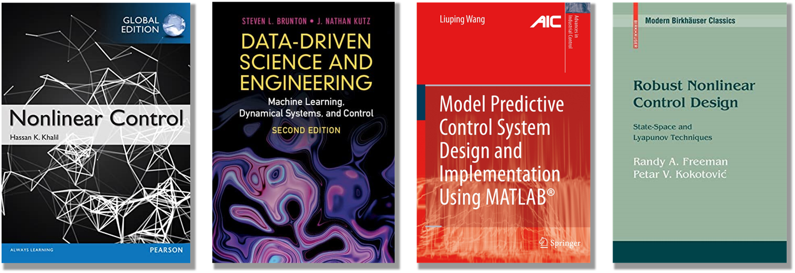

<!-- ### **References** -->

The material of this course is based on techniques which, in my humble opinion, are theoretically interesting and practically significant. This in no way means that the proposed algorithms are the recipe for resolving all your control problems.

### Hand books

Some content of this course is described in the following text books:

### Online materials
There are plenty of online materials that I have used to prepare this course, to mention few: 

* [Control Bootcamp](https://www.youtube.com/playlist?list=PLMrJAkhIeNNR20Mz-VpzgfQs5zrYi085m) - YouTube playlist on the concepts of linear and nonlinear control
* [Data Driven Dynamical Systems and Control](http://www.databookuw.com/) - the online text book and collection of short videos on data driven control and engineering 
* [Optimal Control](https://www.youtube.com/watch?v=6rUdAOCNXAU&list=PLZnJoM76RM6KugDT9sw5zhAmqKnGeoLRa) - Brilliant course on optimal control and learning in robotics from Zachary Manchester 
* [Underactuated Robotis](https://underactuated.mit.edu/) - the perfect course from Russ Tedrake (MIT) on numerical methods in control of various underactuated robots.
* [Slotine's Nonlinear Control](https://www.bilibili.com/video/BV1yb411e7t5/) - personally my favorite course on nonlinear control
* [Identification, Estimation, and Learning](https://www.youtube.com/playlist?list=PLDHxS-d2mJqup7SwhgQjqCkXiDKo4rcL6) - great course on identification, learning and data driven methods in system analysis and control
